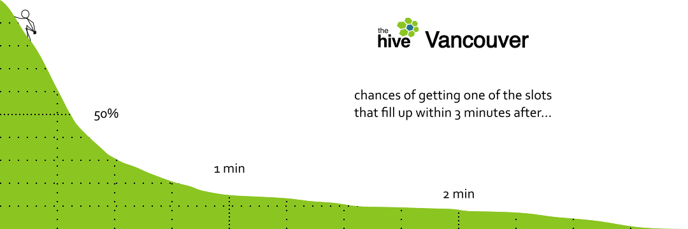

# Hive Booking

This is a collection of scripts and templates I use to collect data from The Hive's Rock Gym Pro booking page and make illustrations. The scripts make use of [Ruby](https://www.ruby-lang.org/), [R](https://www.r-project.org/), [Nemerle](http://nemerle.org/) (a .NET language), and [Inkscape](https://inkscape.org/). The scripts generate three types of illustrations: schedule, fast bookings, and timelines.

## Schedule

Creates an illustration colour-coding The Hive's schedule by the speed with which each slot fills up.

1. Run `dl.rb` for a week to record the status of every slot every minute. The script records data to disk once a day.
2. Run `consolidate.rb` to combine the daily records into a single file.
3. Run `update schedule.rb` to fill the SVG template `schedule.svg` with the collected data. The result is written to `analysis/schedule.svg`.

## Fast Bookings

Creates a diagram  These scripts use the file produced by `consolidate.rb` to get the slot schedule. It is enough to run `dl.rb` only briefly to get enough data for this. However, `time starts.rb` benefits from running for one or more weeks.

1. Run `get schedule.rb` to get the slot schedule from the consolidated file.
2. Run `time starts.rb` to randomly visit each slot several times near its start.
3. Run `analyze starts.r` to generate a density plot for fast starts in `analysis/starts.svg`.
4. Incorporate the plot into `fast booking.svg`.

## Timeline

Creates an illustration showing each slot's status during the whole duration it is available. These scripts use the file produced by `consolidate.rb` to get slot status statistics. Run `dl.rb` for two weeks to gather the data.

1. Compile and run `plot timelines.n` to produce cancellation statistics and the slot diagram in `analysis/timelines.png`.
2. Run `analyze timelines.r` to generate the slot availability density plot in `analysis/cancels.svg`.
3. Incorporate the diagrams into `timelines.svg`.
